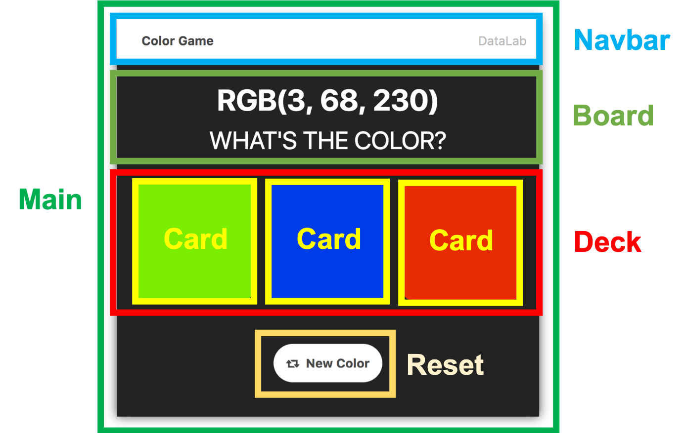

# Lab 3 - Color Game Component Based

 
<!--   -->
In this lab, we will learn how to build a color game with component-based style.

1. Divide the screen into multiple components
2. Decide each component's work 
3. Create component.js to create and handle an event
3. Create .js and .css file for each components and inherits the methods and properties from component class
4. Start coding!  

Please finish the hard mode and nightmare mode with component-based style.  
The requirements of hard mode and nightmare mode are same as [previous assignment](https://shwu10.cs.nthu.edu.tw/courses/software-studio/2021-spring/lab-js-color-game).

## Grading
#### 1. Hard mode **(80%)**

#### 2. Nightmare mode **(20%)**

## Hint 
* Create the mode button
* After clicking the mode button, it should fire an event
* Its father component will handle the click event
* Remember .bind(this) when using `setInterval` and `setTimeout`

## Submission
When you open merge request, the title should be : `{your ID} Submission`

## Important
To test the code, you should run `npm install` first, then run `npm run build` or `npm run watch` sequently.

